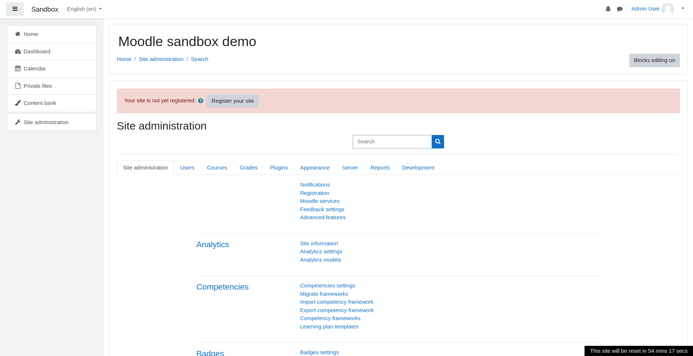
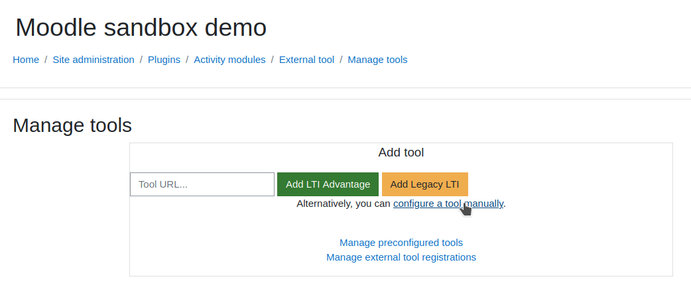
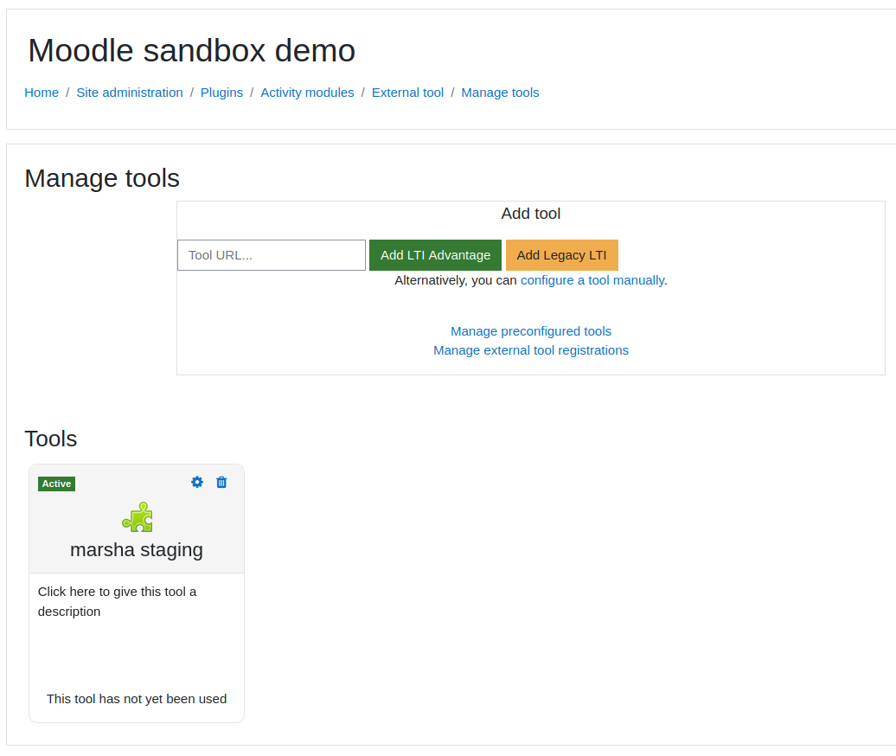
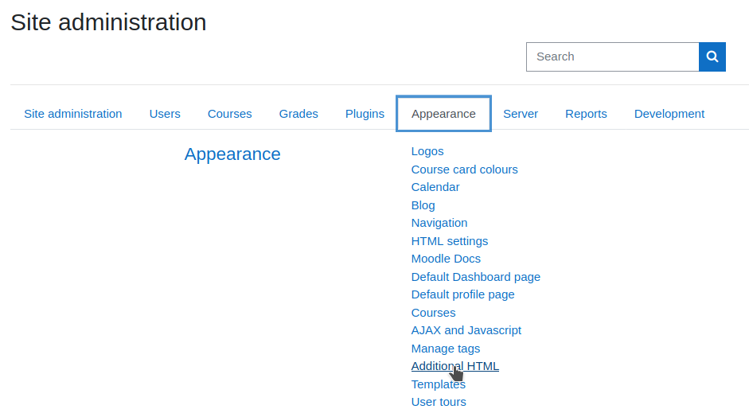
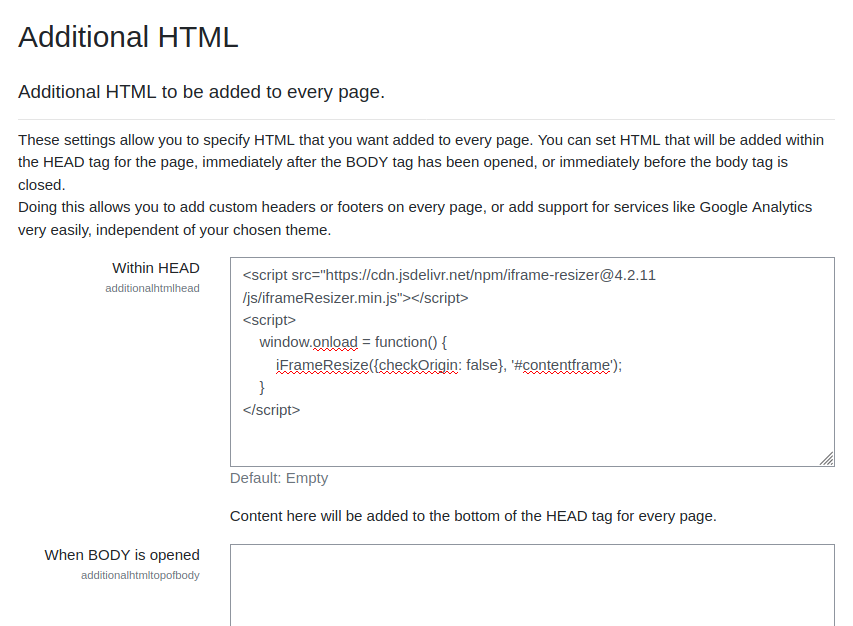
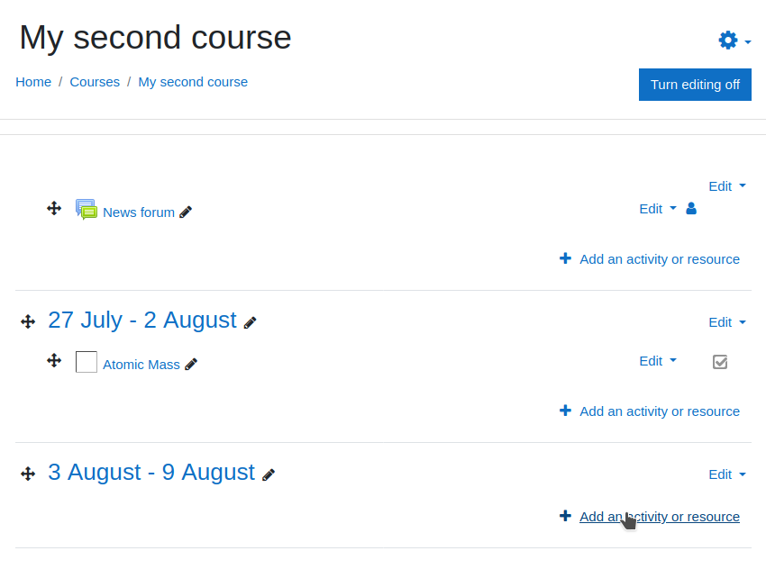
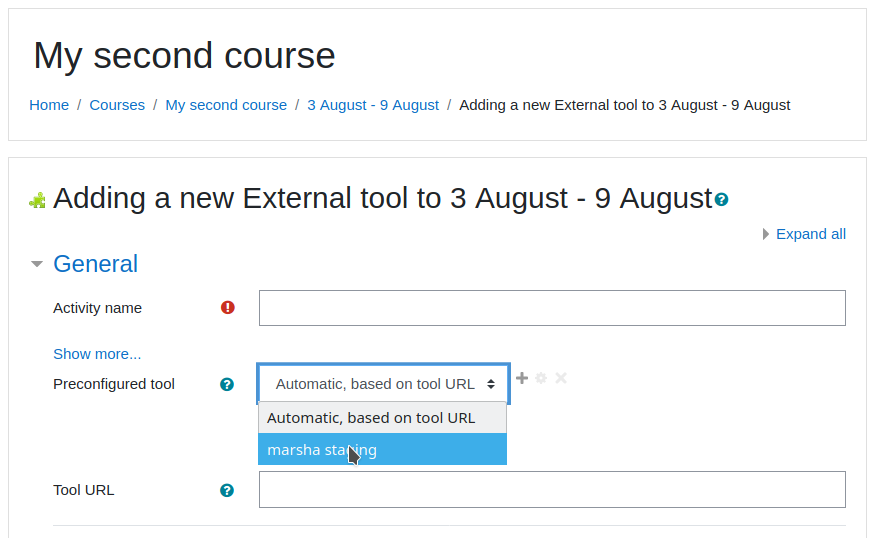
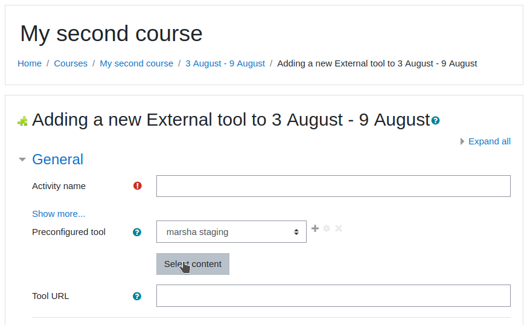
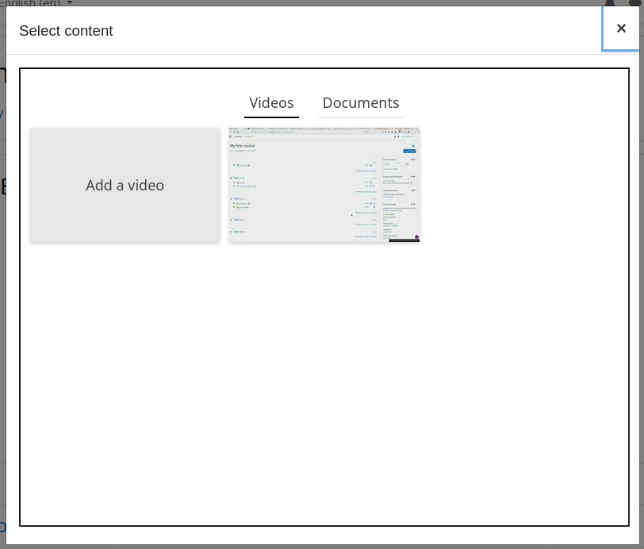

### Moodle Admin setup

#### Prerequisites

Before heading to Moodle, you should get an LTI passport from administrators of the Marsha server to which you want to connect.

The passport should consist in 2 oauth credentials: a consumer key and a shared secret.

#### Create external tool preset

In Moodle, logged as an admin, go to `Site administration`:

<table><tr>
  <td></td>
</tr></table>

Go to `Plugins` tab, and click on `Manage tools` under `External Tools`:

<table><tr>
  <td></td>
</tr></table>

##### Semi-automatic configurations

Several legacy LTI configuration tools are available, which presets the tool with a few parameters, but additional configuration is needed.

To use it, in the `Tool URL…` field, paste a configuration URL and click on `Add Legacy LTI`

| Configuration URL                                    | Description                            |
|------------------------------------------------------|----------------------------------------|
| `https://marsha.education/lti/config.xml`            | Generic configuration for deep linking |
| `https://marsha.education/lti/videos/config.xml`     | Direct video integration               |
| `https://marsha.education/lti/classrooms/config.xml` | Direct classroom integration           |


<table><tr>
  <td></td>
</tr></table>

A form will be displayed, asking for the following parameters:

| Label         | Value                   |
|---------------|-------------------------|
| Consumer key  | [found in the passport] |
| Shared secret | [found in the passport] |

Fill them with the values found in the passport, and click on `Save changes`.

<table><tr>
  <td></td>
</tr></table>

Marsha will be available in the `Tools` list:

<table><tr>
  <td></td>
</tr></table>

Additional configuration is needed. Click on the `Edit` button in the Marsha tool:

<table><tr>
  <td></td>
</tr></table>


Fill the form with following data:

| Label                    | Value                                                |
|--------------------------|------------------------------------------------------|
| Tool configuration usage | Show in activity chooser and as a preconfigured tool |

###### Additional configuration for Deep linking

Fill the form with following data:

| Label                    | Value                                            |
|--------------------------|--------------------------------------------------|
| Supports Deep Linking    | Checked                                          |
| Content Selection URL    | https://marsha.education/lti/select/ (see after) |

:warning: About the Content Selection URL :warning:

By default, using the Content Selection Url `https://marsha.education/lti/select/` allows you to 
select all the available resources in Marsha. You can, if you want, work only on a specific resource
by specifying it in the Content Selection Url. For this, you have to specify the targeted resource at the end of the url. Available
resources are the following:
- Video: https://marsha.education/lti/select/video/
- Webinar: https://marsha.education/lti/select/webinar/
- Document: https://marsha.education/lti/select/document/
- Classroom: https://marsha.education/lti/select/classroom/
- Markdown: https://marsha.education/lti/select/markdown/
- File depository: https://marsha.education/lti/select/deposit/

Once configured with this specific url, every request made will display content about this resource.

Please follow the instructions in [Cookies configuration](#cookies-configuration) and [Iframe resizer](#iframe-resizer) sections below.

##### Manual configuration

Click on `configure a tool manually`:

<table><tr>
  <td></td>
</tr></table>

###### Manual configuration for Direct video integration

Fill the form with following data:

| Label                    | Value                                                |
|--------------------------|------------------------------------------------------|
| Tool name                | Marsha videos                                        |
| Tool URL                 | https://marsha.education/lti/videos/                 |
| LTI version              | LTI 1.0/1.1                                          |
| Consumer key             | [found in the passport]                              |
| Shared secret            | [found in the passport]                              |
| Tool configuration usage | Show in activity chooser and as a preconfigured tool |

Please note that course copy or import / export will need an update of each video's LTI url configuration.
A message will be displayed in the video dashboard if the LTI url is not up-to-date.

###### Manual configuration for Direct classroom integration

Fill the form with following data:

| Label                    | Value                                                |
|--------------------------|------------------------------------------------------|
| Tool name                | Marsha classrooms                                    |
| Tool URL                 | https://marsha.education/lti/classrooms/             |
| LTI version              | LTI 1.0/1.1                                          |
| Consumer key             | [found in the passport]                              |
| Shared secret            | [found in the passport]                              |
| Tool configuration usage | Show in activity chooser and as a preconfigured tool |

Please note that course copy or import / export will need an update of each classroom's LTI url configuration.
A message will be displayed in the classroom dashboard if the LTI url is not up-to-date.

###### Manual configuration for Deep linking

Fill the form with following data:

| Label                    | Value                                                |
|--------------------------|------------------------------------------------------|
| Tool name                | marsha                                               |
| Tool URL                 | https://marsha.education/                            |
| LTI version              | LTI 1.0/1.1                                          |
| Consumer key             | [found in the passport]                              |
| Shared secret            | [found in the passport]                              |
| Tool configuration usage | Show in activity chooser and as a preconfigured tool |
| Supports Deep Linking    | Checked                                              |
| Content Selection URL    | https://marsha.education/lti/select/                 |

<table><tr>
  <td></td>
</tr></table>

Click on `Save changes`.

The new external tool should appear:


<table><tr>
  <td></td>
</tr></table>

You may want to customize the tool's icon and use one of the following in resolution 32x32:

<table><tr>
  <td></td>
  <td></td>
  <td></td>
  <td></td>
</tr></table>

#### Cookies configuration

Secured cookies needs to be enabled for Deep Linking response authentication:

<table><tr>
  <td></td>
</tr></table>

#### Iframe resizer

In order to have iframes resized automatically to show their content,
this snippet can be pasted in another admin view.

Back in the admin view, on `Appearance` tab, click on `Additional HTML`:

<table><tr>
  <td>
    
  </td>
</tr></table>

Paste the following code in `Within HEAD`:

```html
<script src="https://cdn.jsdelivr.net/npm/iframe-resizer@4.2.11/js/iframeResizer.min.js"></script>
<script>
    window.onload = function() {
        iFrameResize({checkOrigin: false}, '#contentframe');
    }
</script>
```

<table><tr>
  <td>
    
  </td>
</tr></table>

### Moodle Teacher / admin usage

Once the external tool is setup, it can be used by teachers.

#### Select an existing content

Go to any course, click on `` and add an activity:

<table><tr>
  <td>
    
  </td>
</tr></table>

<table><tr>
  <td>
    
  </td>
</tr></table>

<table><tr>
  <td>
    
  </td>
</tr></table>

Select `External source`:

<table><tr>
  <td>
    
  </td>
</tr></table>

Select preconfigured tool, and click on `Select content`:

<table><tr>
  <td>
    
  </td>
</tr></table>

<table><tr>
  <td>
    
  </td>
</tr></table>

A popin will appear with available content:

<table><tr>
  <td>
    
  </td>
</tr></table>

Click on a thumbnail, moodle form should be populated:

<table><tr>
  <td>
    
  </td>
</tr></table>

Click on `Save and display`, chosen video should appear:

<table><tr>
  <td>
    
  </td>
</tr></table>

#### Add a new content

The steps are the same as above.

When the Select content popin apears, click on `Add a video`:

<table><tr>
  <td>
    
  </td>
</tr></table>

The form would be populated as above:

<table><tr>
  <td>
    
  </td>
</tr></table>

Click on `Save and display`, video dashboard will appear, allowing upload:

<table><tr>
  <td>
    
  </td>
</tr></table>

Click on `Upload a video` and `Select a file to upload`:

<table><tr>
  <td>
    
  </td>
</tr></table>

<table><tr>
  <td>
    
  </td>
</tr></table>

When upload is done, the video will appear:

<table><tr>
  <td>
    
  </td>
</tr></table>
