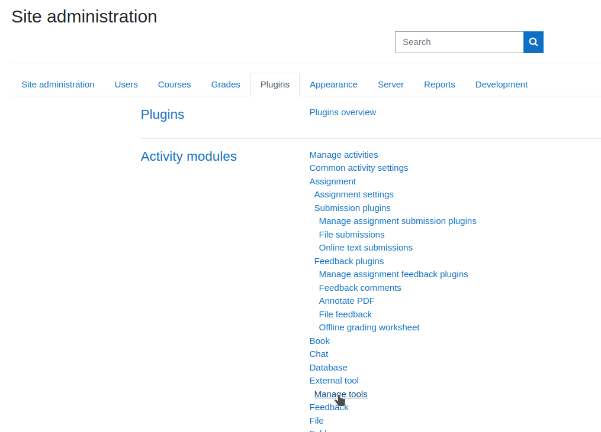
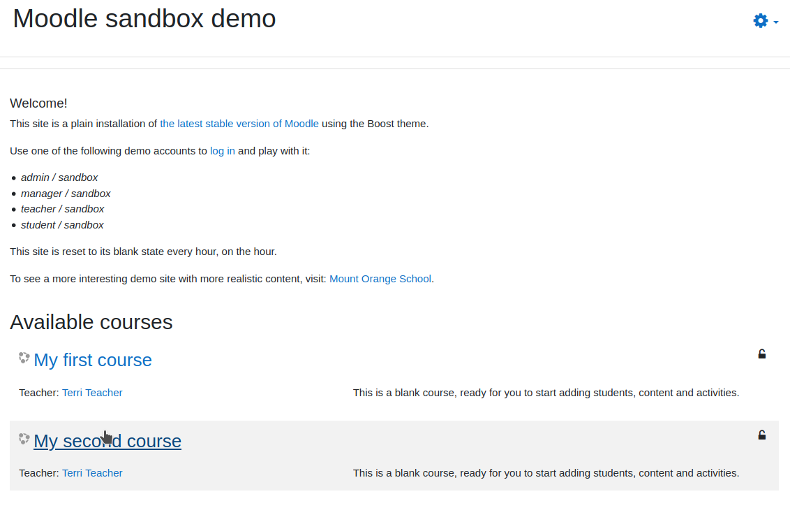
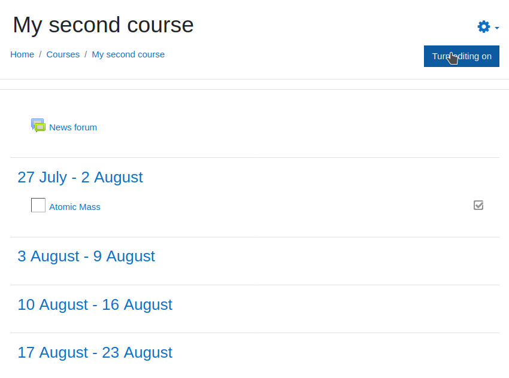
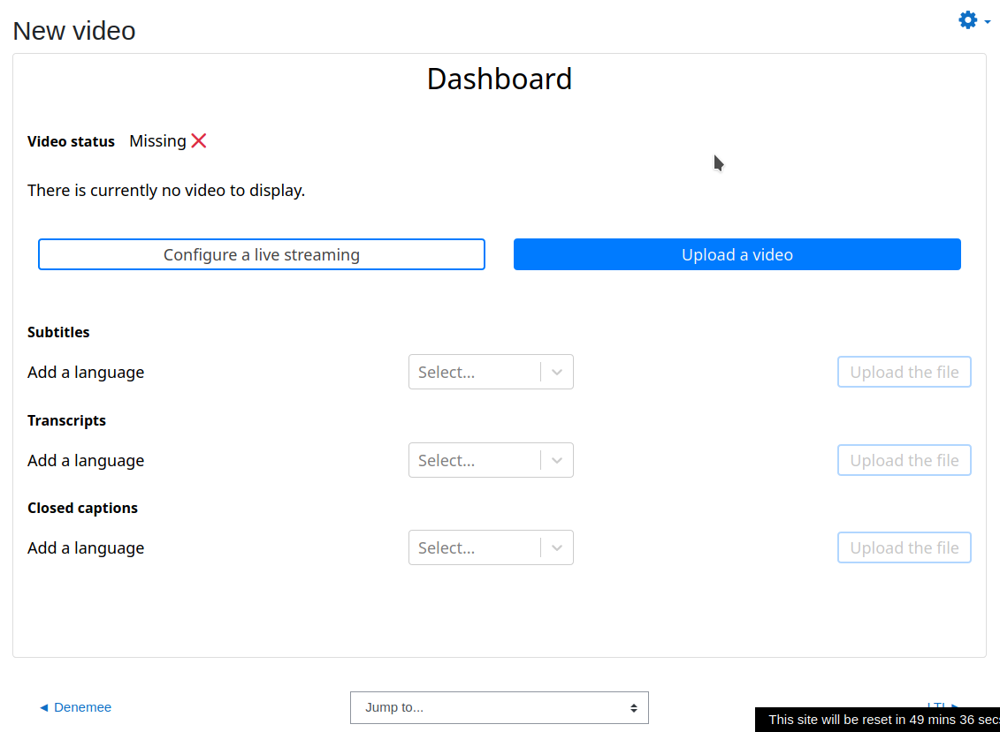

### Moodle Admin setup

#### Prerequisites

Before heading to Moodle, you should get an LTI passport from administrators of the Marsha server to which you want to connect.

The passport should consist in 2 oauth credentials: a consumer key and a shared secret.

#### Create external tool preset

In Moodle, logged as an admin, go to `Site administration`:

<table><tr>
  <td></td>
</tr></table>

Go to `Plugins` tab, and click on `Manage tools` under `External Tools`:

<table><tr>
  <td></td>
</tr></table>

Click on `configure a tool manually`:

<table><tr>
  <td></td>
</tr></table>

Fill the form with following data:

Label                 | Value
--------------------- | ------------------------------------
Tool name             | marsha
Tool URL              | https://marsha.education/
LTI version           | LTI 1.0/1.1
Consumer key          | [found in the passport]
Shared secret         | [found in the passport]
Supports Deep Linking | Checked
Content Selection URL | https://marsha.education/lti/select/

<table><tr>
  <td></td>
</tr></table>

Click on `Save changes`.

The new external tool should appear:


<table><tr>
  <td></td>
</tr></table>

You may want to customize the tool's icon and use one of the following in resolution 32x32:

<table><tr>
  <td></td>
  <td></td>
  <td></td>
  <td></td>
</td></tr></table>

#### Cookies configuration

Secured cookies needs to be enabled for Deep Linking response authentication:

<table><tr>
  <td></td>
</tr></table>

#### Iframe resizer

In order to have iframes resized automatically to show their content,
this snippet can be pasted in another admin view.

Back in the admin view, on `Appearance` tab, click on `Additional HTML`:

<table><tr>
  <td>
    
  </td>
</tr></table>

Paste the following code in `Within HEAD`:

```html
<script src="https://cdn.jsdelivr.net/npm/iframe-resizer@4.2.11/js/iframeResizer.min.js"></script>
<script>
    window.onload = function() {
        iFrameResize({checkOrigin: false}, '#contentframe');
    }
</script>
```

<table><tr>
  <td>
    
  </td>
</tr></table>

### Moodle Teacher / admin usage

Once the external tool is setup, it can be used by teachers.

#### Select an existing content

Go to any course, click on `` and add an activity:

<table><tr>
  <td>
    
  </td>
</tr></table>

<table><tr>
  <td>
    
  </td>
</tr></table>

<table><tr>
  <td>
    
  </td>
</tr></table>

Select `External source`:

<table><tr>
  <td>
    
  </td>
</tr></table>

Select preconfigured tool, and click on `Select content`:

<table><tr>
  <td>
    
  </td>
</tr></table>

<table><tr>
  <td>
    
  </td>
</tr></table>

A popin will appear with available content:

<table><tr>
  <td>
    
  </td>
</tr></table>

Click on a thumbnail, moodle form should be populated:

<table><tr>
  <td>
    
  </td>
</tr></table>

Click on `Save and display`, chosen video should appear:

<table><tr>
  <td>
    
  </td>
</tr></table>

#### Add a new content

The steps are the same as above.

When the Select content popin apears, click on `Add a video`:

<table><tr>
  <td>
    
  </td>
</tr></table>

The form would be populated as above:

<table><tr>
  <td>
    
  </td>
</tr></table>

Click on `Save and display`, video dashboard will appear, allowing upload:

<table><tr>
  <td>
    
  </td>
</tr></table>

Click on `Upload a video` and `Select a file to upload`:

<table><tr>
  <td>
    
  </td>
</tr></table>

<table><tr>
  <td>
    
  </td>
</tr></table>

When upload is done, the video will appear:

<table><tr>
  <td>
    
  </td>
</tr></table>
