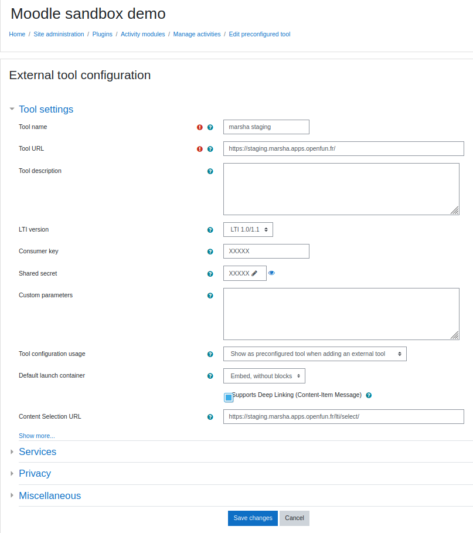
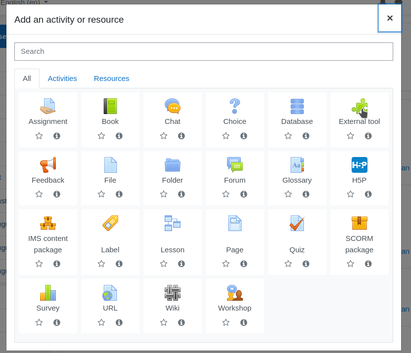
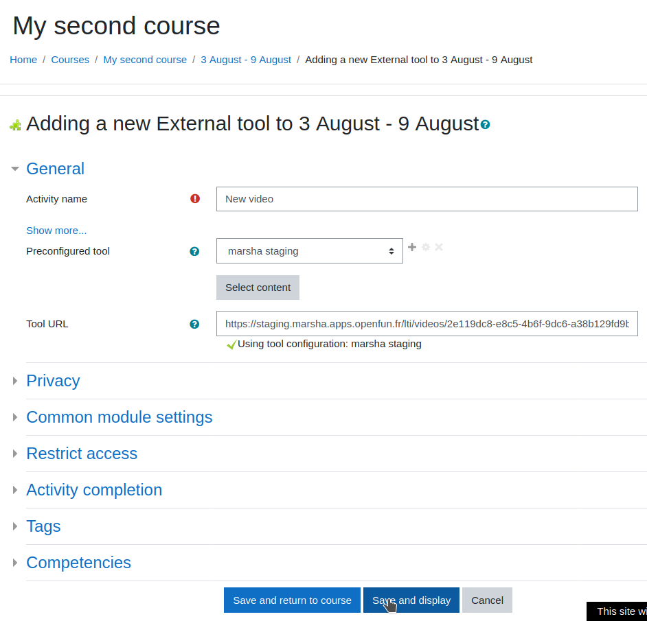
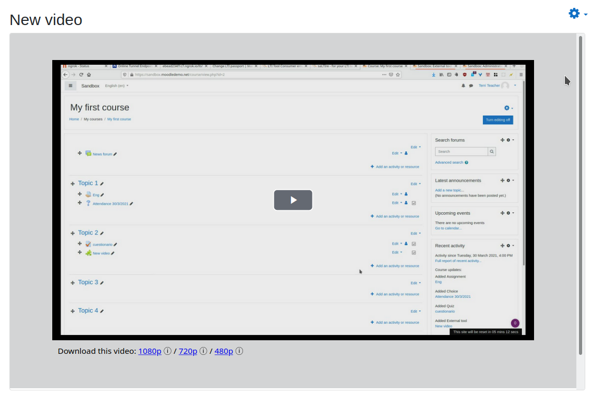

### Moodle Admin setup

#### Create external tool preset
Logged as admin, go to `Site administration`


Go to `Plugins` tab, and click on `Manage tools` under `External Tools`


Click on `configure a tool manually`


Fill the form with following data

Label                 | Value
--------------------- | ------------------------------------
Tool name             | marsha
Tool URL              | https://marsha.education/
LTI version           | LTI 1.0/1.1
Consumer key          | [found in the passport]
Shared secret         | [found in the passport]
Supports Deep Linking | Checked
Content Selection URL | https://marsha.education/lti/select/



Click on `Save changes`

The new external tool should appear.


#### Cookies configuration

Secured cookies needs to be enabled for Deep Linking response authentication.


#### Iframe resizer

In order to have iframes resized automatically to show their content,
this snippet can be pasted in another admin view.

Back in the admin view, on `Appearance` tab, click on `Additional HTML`


Paste following code in `Within HEAD`

```html
<script src="https://cdn.jsdelivr.net/npm/iframe-resizer@4.2.11/js/iframeResizer.min.js"></script>
<script>
    window.onload = function() {
        iFrameResize({checkOrigin: false}, '#contentframe');
    }
</script>
```


### Moodle Teacher / admin usage

Once the external tool is setup, it can be used by teachers.

#### Select an existing content

Go to any course, click on `` and add an activity


Select `External source`



Select preconfigured tool, and click on `Select content`


A popin will appear with available content.


Click on a thumbnail, moodle form should be populated.



Click on `Save and display`, chosen video should appear.



#### Add a new content

The steps are the same as above.

When the Select content popin apears, click on `Add a video`


The form would be populated as above.


Click on `Save and display`, video dashboard will appear, allowing upload.


Click on `Upload a video` and `Select a file to upload`


When upload is done, the video will appear.


