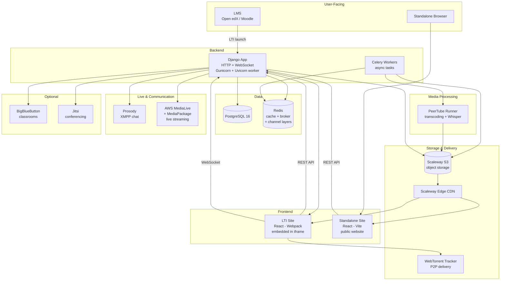

# System Architecture

## High-Level Overview



## Key Data Flows

### Video Upload & Transcoding

```
Instructor uploads video
    → Browser sends file directly to S3 (presigned POST)
    → S3 notifies Django (update-state callback)
    → Django creates Celery task
    → Celery dispatches to PeerTube Runner
    → PeerTube Runner transcodes to multiple resolutions (240p–1080p)
    → PeerTube Runner optionally generates transcript (Whisper)
    → Transcoded files written to S3
    → Django updates video state to "ready"
    → Video served via Scaleway Edge CDN
```

### LTI Launch (Embedding in LMS)

```
Student clicks video in LMS
    → LMS sends signed POST to Marsha (LTI 1.0/1.1 OAuth1)
    → Django verifies signature against LTIPassport
    → Django identifies consumer site and user
    → Django generates JWT token
    → Django serves HTML page with React app + JWT
    → React app loads in iframe, fetches video data via REST API
    → Video player streams from CDN
```

### Live Streaming

```
Instructor starts live session
    → Django creates AWS MediaLive channel + MediaPackage endpoint
    → Instructor streams via RTMP (or Jitsi WebRTC)
    → MediaLive processes stream
    → MediaPackage generates HLS manifest
    → Students watch HLS stream via video player
    → Chat messages flow through Prosody (XMPP)
    → Django relays events via WebSocket (Channels/Redis)
    → When stopped, stream is "harvested" → converted to VOD
```

### P2P Video Delivery

```
Student watches a video
    → Video player loads HLS segments from CDN
    → p2p-media-loader connects to WebTorrent tracker
    → Player shares segments with other viewers (peer-to-peer)
    → Reduces CDN bandwidth by sharing between peers
```

## Component Details

### Django Application

The Django app serves both HTTP and WebSocket traffic:

- **HTTP** — REST API (DRF), LTI endpoints, admin panel, frontend serving
- **WebSocket** — Real-time updates for live sessions (via Django Channels)
- **ASGI** — Runs under Gunicorn with a custom Uvicorn worker (`MarshaUvicornWorker`)

Configuration is managed via `django-configurations` with extensive environment
variable support. See [Environment Variables](../env.md).

### Celery Workers

Background tasks include:
- Video transcoding orchestration
- AI transcript generation
- BBB recording download and conversion
- Video metadata extraction (duration, size)

Broker and result backend: Redis.

### PostgreSQL

Single database storing all application state. All models use UUID primary keys
and soft deletion (django-safedelete).

### Redis

Used for three purposes:
1. **Cache** — Django cache backend with in-memory fallback
2. **Celery broker** — Task queue
3. **Channel layers** — WebSocket message routing (Django Channels)

### Scaleway S3

Object storage with lifecycle rules:
- `tmp/` prefix — temporary uploads, auto-deleted after 21 days
- `vod/` prefix — transcoded video files
- `classroom/` prefix — classroom documents
- `deleted/` prefix — soft-deleted files, auto-cleaned after configurable period

### PeerTube Runner

External transcoding service that processes videos into multiple resolutions.
Communicates with Django via Socket.IO WebSocket. Also handles AI-powered
transcription using Whisper (ctranslate2).

See [PeerTube Runner docs](../peertube-runner.md).

### Prosody (XMPP)

Jabber/XMPP server providing real-time chat for live sessions. Django manages
chat rooms (create, configure, reopen for VOD replay). Uses its own database
within the shared PostgreSQL instance.

### WebTorrent Tracker

Node.js/Express service that coordinates peer-to-peer video sharing between
viewers. JWT-authenticated. Reduces CDN costs for popular videos.

See [P2P Video Player docs](../p2p-video-player.md).

### AWS MediaLive / MediaPackage

Used exclusively for live streaming:
- **MediaLive** — Ingests RTMP streams, processes video
- **MediaPackage** — Generates HLS output for viewers

Note: as of v5.12.0, all other AWS services (S3, Lambda, CloudFront) have been
removed. Storage is now on Scaleway.

### BigBlueButton (Optional)

Virtual classroom system for live teaching. When enabled (`BBB_ENABLED`),
instructors can create classroom sessions with recording support. Recordings
are downloaded to S3 and converted to VOD via Celery tasks.

### Jitsi (Optional)

WebRTC-based video conferencing, used as an alternative live streaming mode
(`live_type=jitsi`). Django generates JWT tokens for Jitsi room access.
