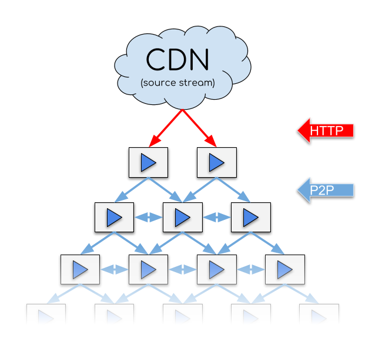
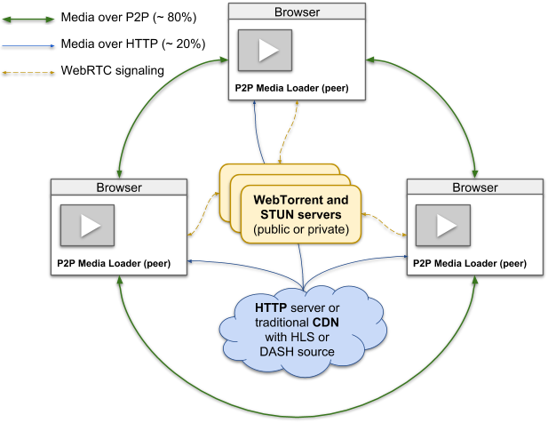

# P2P on VideoJS Player

We created a plugin allowing us to deliver a HLS live stream over P2P to reduce the CDN usage. It uses the open-source [p2p-media-loader](https://github.com/Novage/p2p-media-loader) library, which is also used by [PeerTube](https://github.com/Chocobozzz/PeerTube) (an open-source Youtube alternative delivering videos through P2P).


## How it works

<table><tr>
  <td></td>
</tr></table>

The library creates Peer-to-Peer network (also called P2P CDN or P2PTV) for traffic sharing between users (peers) that are watching the same media stream live or VOD over HLS.

From the official site of the library [p2p-media-loader](http://novage.com.ua/p2p-media-loader/technical-overview.html):

> A web browser runs a video player integrated with P2P Media Loader library. An instance of P2P Media Loader is called peer. Many peers form the P2P network.
>
> P2P Media Loader starts to download initial media segments over HTTP(S) from source server or CDN. This allows beginning media playback faster. Also, in case of no peers, it will continue to download segments over HTTP(S) that will not differ from traditional media stream download over HTTP.
>
> After that P2P Media Loader sends media stream details and its connection details (ICE candidates) to WebTorrent trackers and obtains from them list of other peers that are downloading the same media stream.
>
> P2P Media Loader connects and starts to download media segments from the obtained peers as well as sharing already downloaded segments to them.
>
> From time to time random peers from the P2P swarm download new segments over HTTP(S) and share them to others over P2P.

Also important for our integration:
> P2P Media Loader web browser requirements are:
> - WebRTC Data Channels support to exchange data between peers
> - Media Source Extensions are required by Hls.js and Shaka Player engines for media playback
>
> STUN server is used by WebRTC to gather ICE candidates.
>
> WebTorrent tracker is used for WebRTC signaling and to create swarms of peers that download the same media stream

> **_NOTE:_** It is possible we can face an [issue](https://github.com/Novage/p2p-media-loader/issues/164
) of stream lagging when too much viewers

<table><tr>
  <td></td>
</tr></table>


By default, the library uses public server. In the "recent" version of Chrome ([milestone 110](https://groups.google.com/g/discuss-webrtc/c/L0qDWipd7VE?pli=1)), it perform an extra validation of TURN and STUN Urls making STUN URLs not supporting query section. Thus, the [public STUN server list](https://gist.github.com/mondain/b0ec1cf5f60ae726202e)  is not Chrome compliant and the library won't work, Firefox still works. 

Moreover public servers support a limited number of peers and can reject connections or even go down on a heavy loads.

Therefore, we have to provide our WebTorrent tracker and STUN server. In our settings, we have a setting for each server urls: `P2P_LIVE_STUN_SERVER_URLS` and `P2P_LIVE_WEB_TORRENT_TRACKER_URLS` that will be given to our configuration and used by our frontend. Speaking of settings, we also have `P2P_LIVE_ENABLED` if we want to enable / disable the feature in case of a problem.


## Integration

The `P2P Media Loader` library provides a Hls.js integration (see [p2p-media-loader-hlsjs](https://github.com/Novage/p2p-media-loader/tree/master/p2p-media-loader-hlsjs))  that can be used on different js player, including [Videojs](https://videojs.com/) (the library that we use).

The library gives us a class [`Engine`](https://github.com/Novage/p2p-media-loader/tree/master/p2p-media-loader-hlsjs#engine) that uses [p2p-media-loader-core](https://github.com/Novage/p2p-media-loader/tree/master/p2p-media-loader-core). `p2p-media-loader-hlsjs` offers different function to integrate this `Engine` to several players.

We use the function [initVideoJsHlsJsPlugin](https://github.com/Novage/p2p-media-loader/tree/master/p2p-media-loader-hlsjs#initvideojshlsjsplugin) which is using the [videojs-hlsjs-plugin](https://github.com/streamroot/videojs-hlsjs-plugin). The other possibility uses [videojs-contrib-hls](https://github.com/videojs/videojs-contrib-hls) plugin.

### Implementation

We created `Videojs` plugin (see [doc](https://videojs.com/guides/plugins/#write-a-javascript-classconstructor)) following the "PeerTube way" of adding functionality to their player. In this plugin, we will do the integration of the `Engine` and its configuration in the constructor.

```JS
export class P2pHlsPlugin extends Plugin {
  constructor(player: videojs.Player, options: unknown) {
    // Integration here
  }
}
```

First, we enable the `videojs-hlsjs-plugin`.

```JS
videojsHlsjsSourceHandler.register(videojs);
```

`p2p-media-loader-hlsjs` is coded with the object `videojs` defined in the namespace, which is not our case. Thus, the integration function won't work, but their logic is pretty simple, this is why we copied it.

```JS
videojs.Html5Hlsjs.addHook(
  'beforeinitialize',
  (_videojsPlayer, hlsjs) => {
    if (typeof hlsjs.config?.loader?.getEngine === 'function') {
      this.initHlsJsEvents(hlsjs, hlsjs.config.loader.getEngine());
    }
  },
);
```

Also, the library uses `process` and `Buffer` who are not available because of `react-script: 5+`. This is why we have to import `process` library and add `process` and `buffer` aliases to our webpack config.

We give to our `Engine` instance the wanted configuration (especially for our webtorrent server) like this:

```JS
const engine = new Engine({
  loader: {
    trackerAnnounce: [""], // Wt Server
    rtcConfig: {
      iceServers: [
        { urls: '' }, //  Stun server
      ],
      
    },
  }
});
```

And finally, we give to our player (in a "dirty way") the needed `hlsjsConfig`
```JS
player.options_.html5 = {
  ...player.options_.html5,
  hlsjsConfig: {
    liveSyncDurationCount: 7, // To have at least 7 segments in queue
    loader: engine.createLoaderClass() as unknown,
  },
};
```

And that's it !

Some possible useful information on the [library FAQ](https://github.com/Novage/p2p-media-loader/blob/master/FAQ.md)